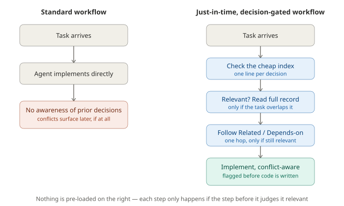
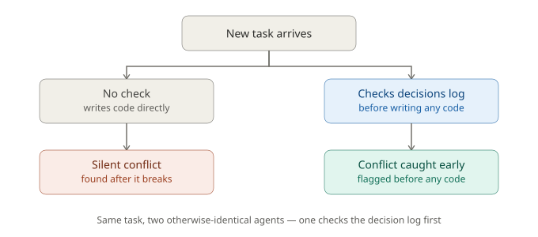

# Decision-Gating: A Cheap Fix for "Wait, Didn't We Already Decide This?"

A small, practical pattern for anyone using AI agents on real projects that span more than one
sitting: write down decisions once, in one place, and have the agent check them before it acts —
not after something breaks.

No vector database. No memory graph. No subscription. Just a folder of short decision records and
one instruction. Tested on a real codebase with the numbers below — not assumed to work, checked.

## The problem this solves

If you've worked with a coding agent across multiple sessions on a real project, you've probably
hit this: you make a decision in one session — an indexing convention, a config pattern, a "we
tried X and it broke, use Y instead" — and three sessions later, a fresh agent (or you, tired)
quietly does the thing you already ruled out. Nothing catches it until it breaks in production.

That's the gap this fills. This is written for anyone — solo developer or small team — running
Claude Code (or a similar coding agent) on a project that outlives a single sitting.

## Where this came from

This pattern is the most rigorously tested piece of a broader personal automation system built
around one principle: a shared fact should have exactly one canonical definition, not several
independently-maintained copies that can silently drift apart. The rest of that system — worth
naming for context, not claimed as evidence here — includes a tiered automatic verification loop
(mechanical checks that escalate to adversarial plan review, then a post-execution critic, only
as needed), a registry connecting decisions across multiple separate projects with explicit
dependency links between them, and cost-tiered model selection matched to how much rigor a given
check actually needs. None of that is tested or measured in this write-up. What follows is the one
piece that was: a small, cheap slice of that system, tested in isolation, on its own.

## This isn't new. Here's what actually is.

Architecture Decision Records have existed for over a decade. Writing decisions down is not the
idea being tested here. The idea being tested is much smaller and easier to miss: **just having
the decisions written down doesn't help.** Nothing about a folder of markdown files makes an agent
actually go read them before it touches your code. By default, a fresh chat session — even a
great one — has no reason to go looking. It just does the task in front of it.

This project adds exactly one thing on top of plain ADRs: a standing instruction that makes the
check happen automatically, every time, before any code gets written. That one small addition is
what got tested — and it's cheap enough, and simple enough, that anyone running agents through
Claude Code (with or without OpenClaw) can drop it into a project this afternoon.

## How it works

1. Every real decision gets a short, dated record (`decisions/0001-whatever.md`) — what was
   decided, why, and what it affects. Optionally, a decision can name `Related:`/`Depends-on:`
   links to other decisions it builds on.
2. One line is added to the agent's instructions: check the decision index before implementing
   anything.
3. If a new task touches something already decided, the agent flags it *before* writing code,
   instead of you finding out three sessions later when something breaks.

That's the entire mechanism. No database, no background process, nothing to maintain beyond the
decision log itself.

**Nothing is loaded by default — everything is pulled on demand.** The index (`INDEX.md`) is a
single line per decision, cheap enough to check on every task. A decision's full body is only
read when the current task's subject matter actually overlaps with an index line — this is exactly
what showed up in testing: the agent resolved clear-cut cases from the one-line index alone, and
only opened a full record when a case was ambiguous enough to need it. `Related:`/`Depends-on:`
links extend this the same way, one hop sideways: if a decision the agent is already reading points
to another one, it can follow that link *if* the linked decision also seems relevant to the task
in front of it — not automatically, just as a cheap pointer that relevance can follow. This pattern
— never pre-loading context, pulling it in only when a specific task judges it necessary — is
sometimes called **just-in-time context loading**, and it's the reason this stays cheap even as a
decision log grows: cost scales with what's actually relevant to a given task, not with how much
has been written down over time.

## Proof it works — tested, not assumed

Two test scenarios on a real, multi-stage routing/clustering pipeline (identifying details
withheld deliberately — the codebase isn't the point, the mechanism is). Each scenario compares
two otherwise identical agents given the same task — one told to check the decision log first,
one not (mirroring the default: nothing forces this to happen unless you build it in):

| Test case | Agent with no check | Agent that checks first |
|---|---|---|
| Cross-stage convention silently drifting between two pipeline steps | ❌ Missed it, wrote a technically correct fix anyway | ✅ Flagged the conflict before touching any code — **19% fewer tokens used** |
| Two steps independently tracking the same file location | ❌ Missed it, wrote a technically correct fix anyway | ✅ Flagged the conflict before touching any code — **24% fewer tokens used** |

Both times, the agent that checked first wasn't just more correct — it was *cheaper* in token
cost, because it didn't have to rediscover the missing context by digging through code. Both
scenarios ran the two agents in separate, isolated working directories with no shared context or
files between them, and every tool call logged, so this is a real comparison, not a staged demo.

A follow-up check (same process, run afterward — not an independent third party) tested the other
direction: does the gate cry wolf on tasks that merely *look* related to a documented decision but
don't actually conflict with it? On the two constructed cases tried, it correctly proceeded both
times instead of over-flagging — in one case explicitly naming the exact condition that *would*
have made it a real conflict, before deciding it wasn't one. This check had no comparison
condition (an ungated agent can't produce a false positive by definition, since it never checks),
so it shows the gate isn't obviously miscalibrated on these two cases — it isn't a broad
calibration guarantee. Full methodology, including who constructed the test cases and what that
means for interpreting the results, is in `ADR_GATING_FINDINGS.md`.

**For anyone running agents across a project that spans more than one sitting** — which is most
real projects — this is the gap it closes: the same fresh-context problem that makes you
re-explain yourself to an agent every morning is exactly what silently lets old decisions get
overridden without anyone noticing.

## This isn't the only tool that does this

Worth saying plainly: this pattern isn't undiscovered territory, and worth describing accurately
rather than deferring to marketing copy. [`adr-kit`](https://github.com/rvdbreemen/adr-kit) builds
real infrastructure around a similar idea — but as of this writing it has 4 GitHub stars and 0
forks, built by one person; it's not an established standard, just another small project in the
same young space. Its default enforcement is also a different kind of mechanism: declarative
pattern-matching (regex rules like "forbid this import") checked against a diff at commit time.
That's a good fit for rules expressible as a simple pattern, and a poor fit for the two bugs
actually tested here — both required reading and reasoning about a relationship between files,
not matching a pattern. What this project adds isn't a better or more mature tool. It's disclosed,
measured evidence that checking decisions before implementing changes outcomes specifically for
this kind of semantic, cross-file drift — the kind a rule engine can't easily encode in advance.

## When this does *not* help — read this before adopting it

Two different things were tested in this project, and it's worth being precise about which is
which. This pattern (checking a decision log before implementing) is the one shown above, where
the checking agent clearly beat the non-checking agent, twice, at lower cost both times.

A separate, unrelated test asked a different question: does splitting a code review across
several parallel agents find more bugs than one continuous agent reviewing the same code in one
pass? There, they performed about the same — decomposition added no advantage. **That result has
nothing to do with decision-gating** — it was testing bug-discovery, not conflict-checking, and
it doesn't mean this pattern's gains are illusory. It's reported here because it's a real, honest
finding from this same project, not because it undercuts the result above.

The actual limit on this pattern is narrower and simpler: **if you're doing a single task in one
sitting, with nothing decided before it, there's nothing for the gate to check** — it needs an
existing decision to be checking against. The benefit only shows up in one specific, real
situation: **work that spans more than one session, where a decision made last week (or by
someone else) needs to still be respected today.** That's a narrow niche — but it's a real and
common one for any ongoing project, and it's the one place a plain chat has no way to help you,
because a plain chat has no way to know what it doesn't know.

Other honest limits:
- **Not a memory system.** Large-scale conversational memory (Mem0, Zep, Letta, etc.) solves a
  different, harder problem. This is deliberately narrower, which is exactly why it's cheap.
- **Two tested cases, not a guarantee.** A real, disclosed result — not a claim that this works
  in every situation.

## Why it's worth using

If you're spending agent time re-explaining the same context every session, or finding out about
contradicted decisions only after something breaks, this costs almost nothing to add and has
measurably caught real conflicts before they became bugs — for a fraction of the token cost of
running a full memory-graph system for the same job.

## Getting started

1. Add a `decisions/` folder with an `INDEX.md`.
2. Write one short record per real decision (template: context → decision → consequences).
3. Add one line to your agent's system prompt or `CLAUDE.md` (the project-level instructions file
   Claude Code reads automatically): *"Before implementing a change, check `decisions/INDEX.md`
   for anything relevant, and flag any conflict before writing code."*

That's it. No infrastructure to stand up.
